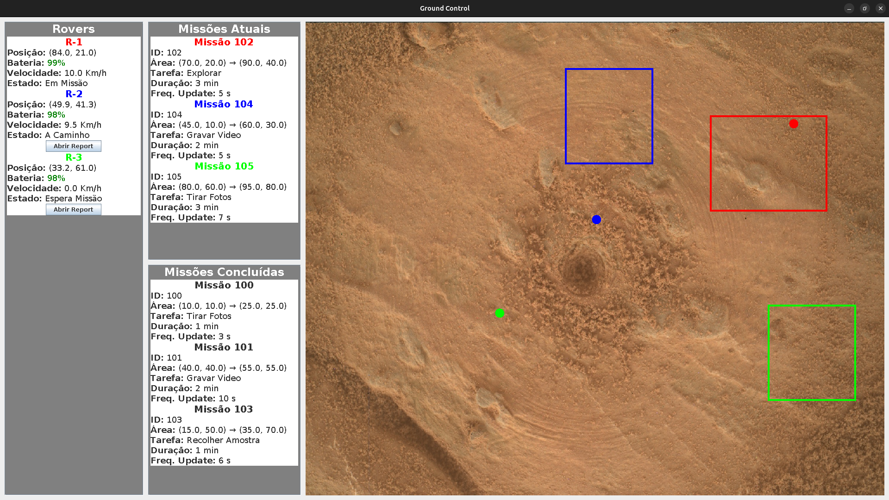

# CC (Comunicações por Computador) (Português)

Projeto de grupo desenvolvido no âmbito da UC de CC. O projeto consiste na implementação de protocolos que correrm sobre UDP (MissionLink) e TCP (TelemetryStream) para a comunicação entre _Rovers_ e uma Nave Mãe, numa simulação de missões espaciais.
Pode consultar o [enunciado](TP_CC_2526.pdf) do projeto e o respetivo [relatório](Relatorio_CC.pdf).

## Membros do grupo:

* [darteescar](https://github.com/darteescar)
* [luis7788](https://github.com/luis7788)
* [tiagofigueiredo7](https://github.com/tiagofigueiredo7)

### Nota Final: ?? / 20 ⭐️



## Dependências 

Para poder correr as topologias criadas e testar os protocolos é necessário ter o [CORE](https://github.com/eivarin/Dockerized-Coreemu-Template) instalado.
Para o **CORE** ter acesso ao código fonte, é necessário que o mesmo se encontre na diretoria *volume/*, que é partilhada pelo Docker e pela sua máquina.

## Ambiente de testes
Para testar os protocolos abra no CORE qualquer uma destas três topologias desenvolvidas:

- final-clean.xml
- final-easy.xml
- final-hard.xml

Corra a topologia. Abra os terminais dos nós dos _Rovers_ que pretende testar, da _Nave Mãe_ e do _Ground Control_. Em cada um dos terminais abertos certifique-se que se encontra na diretoria *mission/* :

```bash
$ cd mission/
```

### Compile

Para compilar o projeto faça:

```bash
$ make compile
```

### Run

Para correr a _Nave Mãe_ faça no seu terminal:

```bash
$ make navemae IP= ip_nave_mae
```

Onde o IP corresponde ao valor contido na topologia.

Para correr os _Rovers_ faça nos seus terminais:

```bash
$ make rover ID=R-X IP_ROVER=X.X.X.X PORTA=7000 IP_NAVEMAE=ip_nave_mae
```

Onde o ID e o IP correspodem aos valores contidos na topologia.

Para correr o _Ground Control_ faça no seu terminal:

```bash
$ make groundcontrol
```
### Rebuild

Para reconstruir o projeto faça:

```bash
$ make rebuild
```

### Clean

Para remover os ficheiros gerados pelo compile o projeto faça:

```bash
$ make clean
```


# CC (Computer Communications) (English)
Group project developed within the scope of the CC course. The project consists of the implementation of protocols that run over UDP (MissionLink) and TCP (TelemetryStream) for communication between Rovers and a Mother Ship, in a simulation of space missions. You can consult the [statement](TP_CC_2526.pdf) of the project and the respective [report](Relatorio_CC.pdf).

## Group members:
* [darteescar](https://github.com/darteescar)
* [luis7788](https://github.com/luis7788)
* [tiagofigueiredo7](https://github.com/tiagofigueiredo7)

### Final Grade: ?? / 20 ⭐️

## Dependencies
To run the created topologies and test the protocols, you need to have [CORE](https://github.com/eivarin/Dockerized-Coreemu-Template) installed. For **CORE** to have access to the source code, it is necessary that it is in the *volume/* directory, which is shared by Docker and your machine.

## Testing environment
To test the protocols, open any of these three developed topologies in CORE:

- final-clean.xml
- final-easy.xml
- final-hard.xml

Start the topology. Open the terminals of the nodes of the _Rovers_ you want to test, of the _Mother Ship_ and of the _Ground Control_. In each of the opened terminals make sure you are in the *mission/* directory:

```bash
$ cd mission/
```

### Compilation
To compile the project do:

```bash
$ make compile
```

### Run
To run the _Mother Ship_ do in its terminal:

```bash
$ make navemae IP= mother_ship_ip
```

Where the IP corresponds to the value contained in the topology.

To run the _Rovers_ do in their terminals:

```bash
$ make rover ID=R-X IP_ROVER=X.X.X.X PORTA=7000 IP_NAVEMAE=mother_ship_ip
```

Where the ID and IP correspond to the values contained in the topology.

To run the _Ground Control_ do in its terminal:

```bash
$ make groundcontrol
```

### Rebuild
To rebuild the project do:

```bash
$ make rebuild
```

### Clean
To remove the files generated by compiling the project do:

```bash
$ make clean
```